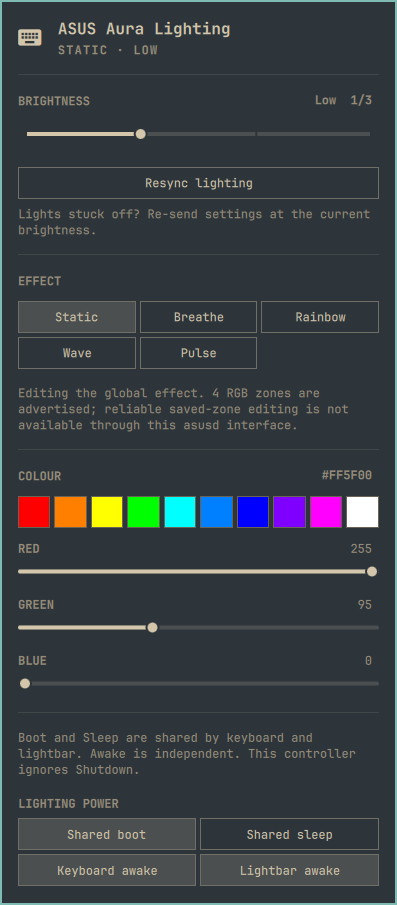

# ASUS Aura Lighting

An Omarchy bar widget for ASUS Aura keyboard and lightbar lighting, using the `asusd`
system D-Bus service directly. This is **not a generic keyboard-backlight
controller** and does not use OpenRGB.

<p align="center">
  
</p>

## Features

- Keyboard brightness slider, scroll-wheel adjustment, and on/off toggle.
- Daemon-reported Aura effects, with controls for Static, Breathe, Rainbow,
Wave, and Pulse.
- Colour presets and RGB sliders; two independent colours where the effect
supports them.
- Effect speed and direction where applicable.
- Controller-aware lighting power controls. On the tested 1866 controller:
shared Boot/Sleep, independent Keyboard/Lightbar Awake, and no ineffective
Shutdown toggle. Newer controllers expose their supported per-zone policies.
- Ordered, coalescing writes, visible errors, and brightness preservation
(including Off) when changing modes, colours, speeds, or directions.
- Detection of global versus zoned lighting; global edits are blocked while
zoned lighting is active or its state is unknown. Replacing active zones
requires the explicit **Use global effect (replace zones)** action.
- Resync action that re-sends the daemon's saved power/effect settings while
preserving current brightness, including Off.
- Terminal/keybinding commands through `omarchy-shell`.


## Requirements and compatibility

- Omarchy's Quickshell-based shell with the plugin API (`qs.Ui` and
`qs.Commons`). This is not a Waybar module or a standalone Quickshell app.
- A supported ASUS Aura keyboard and a running `asusd` system service,
provided by `asusctl` on Arch Linux.
- `busctl` (systemd) and Python 3. The helpers use only the standard library;
no pip dependencies are needed.
- Read access to `/etc/asusd/aura_<product>.ron` on zoned keyboards, to verify
the daemon's `multizone_on` flag. This file is **never modified** by the plugin.
If it is unreadable or unrecognized, effect-parameter editing fails closed;
brightness, saved-mode selection, power, and Resync remain available.
- Permission for your normal desktop user to access ASUS lighting properties
through the system D-Bus service. Do not run the shell as root.

Install missing dependencies through your distribution's package manager;
this plugin does not install packages, configure permissions, or enable
services automatically. Follow the [ASUS Linux documentation](https://asus-linux.org/)
for hardware and daemon setup.

### Development machine

The following environment was recorded during publication preparation; it
is a reference configuration, **not a minimum-version or compatibility matrix**:


| Component  | Version / model                                   |
| ---------- | ------------------------------------------------- |
| Laptop     | ASUS ROG Strix G513QM (`ROG Strix G513QM_G513QM`) |
| Omarchy    | 4.0.4-1                                           |
| Kernel     | 7.2.5-3-omarchy                                   |
| asusctl    | 6.4.0-2                                           |
| Quickshell | 0.3.1-1                                           |


Effect metadata was developed against this laptop. Other models and daemon
versions have not been verified.

### Known limitations

- The first discovered `/xyz/ljones/aura/...` device is selected; there is no
multi-device selector.
- Requires the `xyz.ljones.Aura` properties `Brightness`, `LedMode`,
`LedModeData`, `LedPower`, `SupportedBasicModes`, `SupportedBrightness`,
`DeviceType`, `SupportedBasicZones`, and `SupportedPowerZones`.
Older or incompatible D-Bus interfaces may not work.
- **Per-zone RGB editing is not implemented.** The tested machine advertises
four keyboard zones, but asusd 6.4 has no saved-zone D-Bus readback and has a
multizone activation/persistence bug. The plugin does not invent saved values
or silently switch zoned lighting off. See [capability details](docs/CAPABILITIES.md).
- Separate lightbar RGB zones are not advertised on the tested machine;
lightbar Awake control is available. No raw USB/per-key editor is provided.
- Unknown effect IDs can be selected if advertised but receive no guessed
parameter controls; unknown controller types receive no guessed power controls.
- The recovery helper currently accepts brightness values from 0 through 3.
- The widget stays visible with an error when compatible ASUS state cannot be
read. IPC commands require the widget to be loaded by the shell.
- Commands are asynchronous and queued. After a write failure, dependent
pending writes are cancelled and live state is refreshed. Other applications
can still race D-Bus operations; this is not a cross-client transaction.
A successful service call does not prove that physical LEDs illuminated.
Resync is not a firmware reset, does not force the Awake flag on, and is not
an automatic suspend/resume hook.


## Installation

After this repository is published, replace `OWNER/REPOSITORY` with its actual
GitHub path:

```sh
omarchy plugin add https://github.com/OWNER/REPOSITORY.git --enable
```

No marketplace listing is required for installation from GitHub. Review the
source before enabling it: Omarchy plugins run unsandboxed as your user.

## Usage

- **Click** the bar icon to open or close the panel.
- **Scroll** over the icon to change brightness.
- **Right-click** the icon to toggle the backlight, restoring the last nonzero
brightness remembered by this widget instance.
- Use the panel to choose global effects, colours, speed, direction, and
controller-appropriate keyboard/lightbar power flags.
- Use **Resync** to re-send the daemon's settings if lighting appears out of
sync, without intentionally changing brightness.

```sh
omarchy-shell this-self.asus-aura state
omarchy-shell this-self.asus-aura set 2
omarchy-shell this-self.asus-aura mode 1
omarchy-shell this-self.asus-aura resync
```

See [COMMANDS.md](COMMANDS.md) for the complete IPC reference and standalone
recovery instructions.

## Removal and persistent settings

```sh
omarchy plugin remove this-self.asus-aura
```

Removal does not uninstall `asusctl` or dependencies, stop `asusd`, or restore
previous lighting settings. Changes are applied through `asusd`, which owns
its saved lighting configuration; set your preferred lighting before removing
the plugin or use `asusctl` / ROG Control Center afterward.

The plugin creates no separate persistent settings file and installs no
hooks or system configuration. Development-only QML import links, if created,
live outside the plugin directory; see [DEVELOPMENT.md](DEVELOPMENT.md).

## Development and publishing

See [DEVELOPMENT.md](DEVELOPMENT.md) for QML tooling, validation, and the
publication checklist. Please include your laptop model, software versions,
and any shell/service error messages when reporting compatibility problems.
Do not include serial numbers or other private information.

## License

[MIT](LICENSE), copyright 2026 this-self.